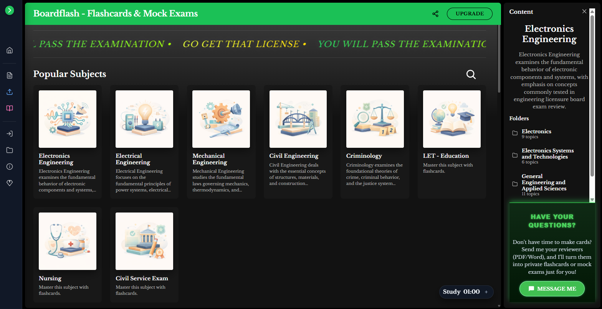
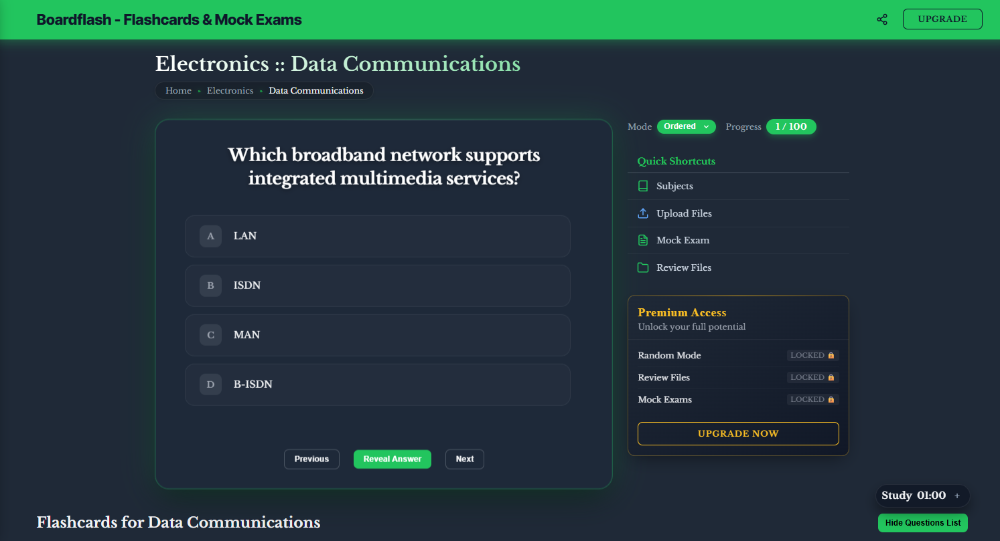
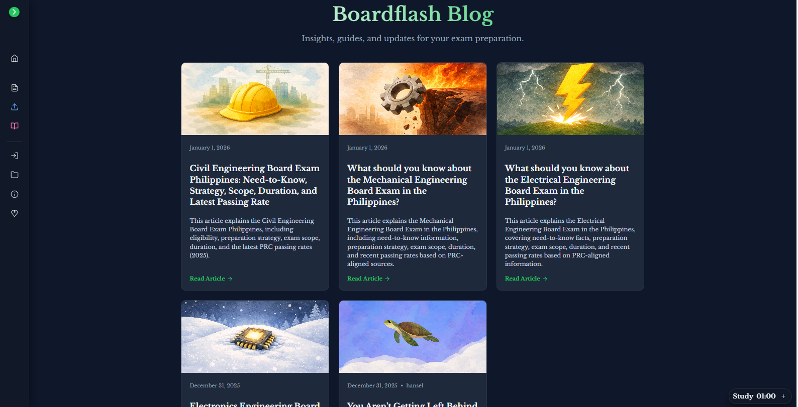
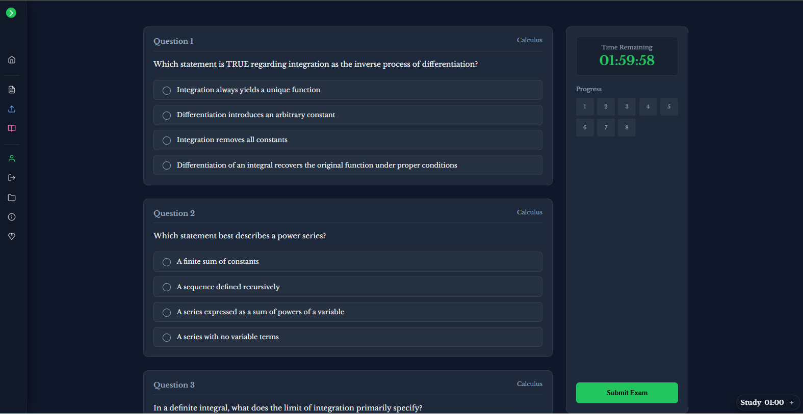

# Project Name

A Django-based web application designed to help students prepare for board and professional examinations through structured review tools such as flashcards, formula summaries, blog articles, and mock exams.

## Overview

This project is an online board exam review platform focused on making review materials organized, accessible, and easy to use.  
It is built to support self-paced learning and serves as a foundation for expanding into multiple professional and licensure exams.

## Key Features

Flashcards
- Topic-based flashcards for fast recall
- Suitable for definitions, laws, principles, and key terms
- Designed for short, focused review sessions

Formula Review
- Dedicated formula flashcards and summaries
- Emphasizes understanding relationships between variables
- Useful for math, engineering, and science-related exams

Educational Blog Posts
- Concept explanations and review articles
- Clarifies commonly misunderstood topics
- Supports deeper learning beyond memorization

Mock Exams
- Multiple-choice mock examinations
- Structured to resemble real board exams
- Helps assess readiness and identify weak areas

## Tech Stack

- Backend: Django (Python)
- Frontend: HTML, CSS
- Database: SQLite (development)
- Environment Management: python-dotenv
- Version Control: Git & GitHub

## Screenshots

Homepage

Flashcards

Blog Posts

Mock Exams
